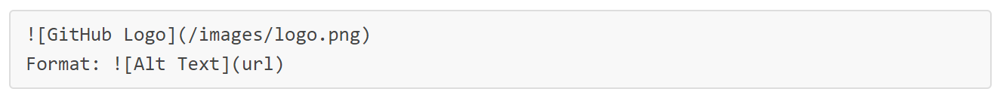

# My GitHub Pages site
This is the html image:

This is the markdown image:

Format: 

# General workflow for making a website with GitHub Pages
Follow these instructions to make a website with _GitHub Pages_.

1. Create a new repository for your site
2. Create a branch to hold your changes
3. Add some files for your website. At a minimum, you need a file for the homepage. You can name this file index.md
